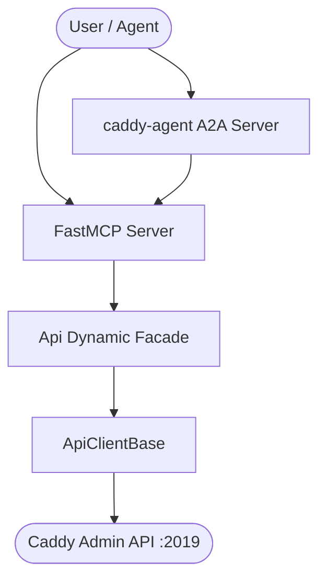

# Technical Overview — caddy-mcp

`caddy-mcp` provides native integration with the **Caddy Admin API** for Pydantic-AI
agents and any MCP client. It isolates the model from the underlying API transport,
exposing safe, idempotent, traceable operations over Caddy's live configuration.

## Architecture

A `requests`-based REST client (`Api`) wraps the Caddy Admin API and is surfaced
through FastMCP tools under the `cd` multiplexer prefix. The same client backs the
`caddy-agent` Pydantic-AI A2A agent.

## Tool surface

The server registers three action-dispatch tools, each taking an `action` and a
`params_json` payload:

| Tool | Tag | Capability |
|---|---|---|
| `caddy_mcp_config` | `config` | Read, set, patch, and delete configuration by path or `@id` tag; load and adapt Caddyfiles; control the server |
| `caddy_mcp_pki` | `pki` | Inspect the PKI app CAs and certificate chains |
| `caddy_mcp_reverse_proxy` | `reverse_proxy` | Query reverse-proxy upstream health |

The full request/response contract follows the upstream
[Caddy Admin API](https://caddyserver.com/docs/api). See [Usage](usage.md) for the
client methods, example prompts, and the agent interface.
